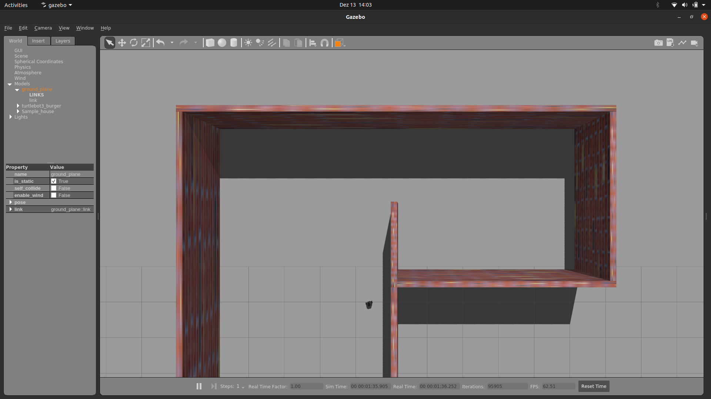

Lab3 assignment: create python code to follow the wall and navigate to different rooms

Steps: 
1) Get Lidar values
2) Check for nearby wall
3) Decide to follow left/right wall
4) Go close to that wall
5) Follow that wall
6) Navigate to different rooms

